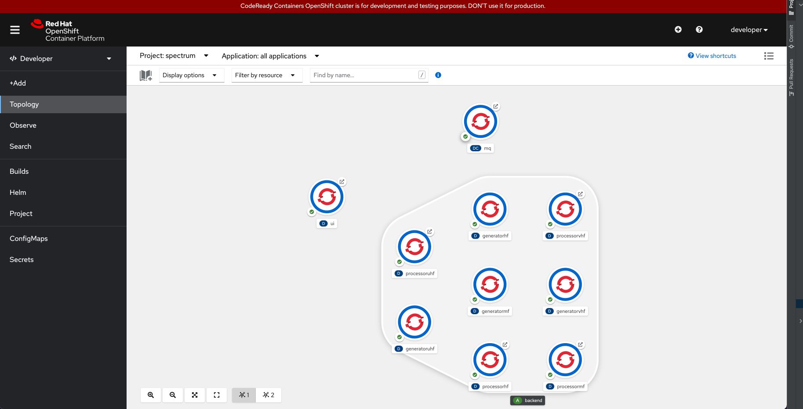

# spectrum
Containerized fake spectrum generator backed by NodeJS and RabbitMQ and visualized via Bootstrap powered HTML5 UI that comprises PlotlyJS and WebSocket and packed via webpack:

<p float="center">
  
  
  
  
</p>

## Docker Compose
The project has docker-compose [setup](./docker/compose/docker-compose.yml) with Traefik edge router:

@ [compose](./docker/compose) directory:
```shell
% docker-compose up --build
```

The hosts file should contain following entries that matches to localhost:
```shell
% cat /etc/hosts
localhost app.poc.local
localhost web.poc.local
localhost mq.poc.local
```

## Kubernetes (k8s)
The project has deployment objects generated via [kompose](https://kompose.io/) tool using a [compliant compose file](./docker/compose/docker-compose.k8s.yml) derived from original compose [file](./docker/compose/docker-compose.yml). The generation steps is as follows:
* For local deployments minikube should be started and ingress controller (NGINX) should be enabled:
  ```shell
  % minikube start
  😄  minikube v1.24.0 on Darwin 12.1
  ...
  🐳  Preparing Kubernetes v1.22.3 on Docker 20.10.8 .../ 
  🏄  Done! kubectl is now configured to use "minikube" cluster and "default" namespace by default
  % eval $(minikube -p minikube docker-env)
  % minikube addons enable ingress
  ```
* As minikube node runs on VM a public DNS entry should exist for that VM
  ```shell
  % minikube ssh
  # rm /etc/resolv.conf
  # echo "nameserver 8.8.8.8" >> /etc/resolv.conf
  # echo "nameserver 192.168.64.1" >> /etc/resolv.conf
  # echo "search ." >> /etc/resolv.conf
  # systemctl restart docker
  # exit
  logout
  $ exit
  logout
  ssh: Process exited with status 130
  ```

@ [compose](./docker/compose) directory:

* As original compose file contains environment variables from [.env](./docker/compose/.env) file one need to convert this to a file with variables interpolated: 
    ```shell
    % docker-compose -f docker-compose.k8s.yml convert > docker-compose.k8s.converted.yml
    ```
* The converted version is not compatible with kompose tool as service definitions should be seperated with a white space and ports should be defined in `<host-port>:<container-port>` format:
  ```shell
  ERROR Could not parse config for project compose : Unsupported config option for services service: 'generatorHF'
  ```
* After converted file is normalized kompose tool is executed to generate k8s object based on given compose file. The `--build` option should also be used to build custom images defined in compose file and push them to Docker registry of minikube. The k8s related files are saved in [k8s](./k8s) folder:
  ```shell
  % kompose convert -f docker-compose.k8s.converted.yml --build local --out ../../k8s
  INFO Service name in docker-compose has been changed from "generatorUHF" to "generatoruhf" 
  INFO Service name in docker-compose has been changed from "processorHF" to "processorhf"
  ...
  INFO Build key detected. Attempting to build image 'custom/spectrum/generator'
  INFO Building image 'custom/spectrum/generator' from directory 'app'
  ...
  INFO Building image 'custom/spectrum/ui' from directory 'ui' 
  INFO Image 'custom/spectrum/ui' from directory 'ui' built successfully
  INFO Kubernetes file "../../k8s/mq-service.yaml" created
  ...
  INFO Kubernetes file "../../k8s/processorvhf-deployment.yaml" created
  INFO Kubernetes file "../../k8s/ui-deployment.yaml" created
  ```
* @ [k8s](./k8s) directory `imagePullPolicy` should be updated as `Never` for deployments with custom built images:
  ```shell
  % for file in $(ls *-deployment.yaml); do
      patch="{\"spec\":{\"template\":{\"spec\":{\"containers\":[{\"name\":\"$(echo $file | awk -F'-' '{print $1}')\", \"imagePullPolicy\": \"Never\"}]}}}}"
      kubectl patch -f $file -p $patch --dry-run=client --output yaml > "patched.${file}"
      rm $file
    done
  ```
* @ [k8s](./k8s) directory the service and deployments can be created:
  ```shell
  % kubectl apply -f .                                                                 
  deployment.apps/generatorhf created
  ...
  service/ui-tcp configured
  
  % kubectl apply -f ./ingress 
  ingress.networking.k8s.io/processorhf-ingress created
  ingress.networking.k8s.io/processormf-ingress created
  ingress.networking.k8s.io/processoruhf-ingress created
  ingress.networking.k8s.io/processorvhf-ingress created
  ```
* All pods should be in running state:
  ```shell
  % kubectl get pods
  NAME                            READY   STATUS    RESTARTS   AGE
  generatorhf-6b98c95b75-xfhd6    1/1     Running   0          9s
  generatormf-67ff45d8d-ddbk6     1/1     Running   0          9s
  generatoruhf-84db4c9b88-ftp2j   1/1     Running   0          9s
  generatorvhf-9bfc78965-74jnn    1/1     Running   0          9s
  mq-64c86d8d7b-mnnsw             1/1     Running   0          9s
  processorhf-76b896f6b7-wvtsk    1/1     Running   0          9s
  processormf-54d9f96776-zl67b    1/1     Running   0          9s
  processoruhf-54bd7fb48b-mvp4b   1/1     Running   0          9s
  processorvhf-6ddb9d6567-jglfm   1/1     Running   0          9s
  ui-86955b6b77-prn9t             1/1     Running   0          8s
  ```
* The hosts file should contain following entries that matches to minikube IP:
  ```shell
  % minikube ip
  192.168.64.10
  % cat /etc/hosts
  192.168.64.10 app.poc.local
  192.168.64.10 web.poc.local
  192.168.64.10 mq.poc.local
  ```
* To launch the UI minikube service command should be invoked via CLI:
  ```shell
  minikube service ui-tcp                   
  |-----------|--------|-------------|----------------------------|
  | NAMESPACE |  NAME  | TARGET PORT |            URL             |
  |-----------|--------|-------------|----------------------------|
  | default   | ui-tcp | 8080/8080   | http://192.168.64.10:30890 |
  |-----------|--------|-------------|----------------------------|
  🎉  Opening service default/ui-tcp in default browser...
  ```

## OpenShift (OCP)
The project contains deployment utilities tested on CodeReady Containers (CRC) platform:
* A [build script](./ocp/build.sh) to generate and push images via S2I and custom methods
* A [deploy script](./ocp/deploy.sh) that generates, updates and deploys app resources and apps.


